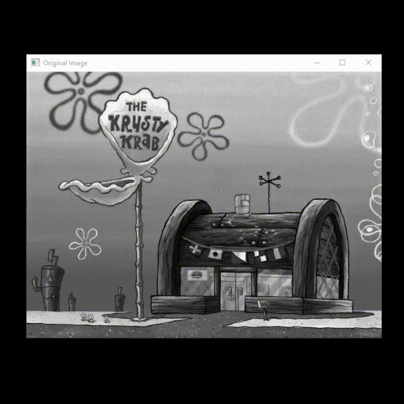
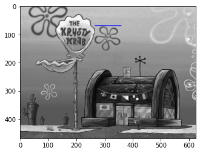
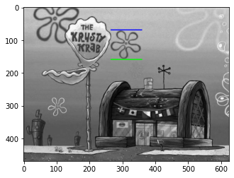
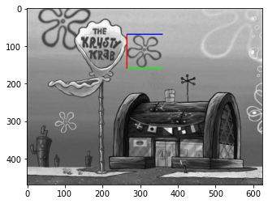
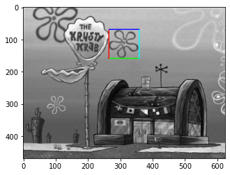

# Resolução TAREFA 1

- **Como uma imagem é representada no computador? Matriz, Vetor?**
  - Uma imagem é um conjunto de pixels que são armazenados num array em forma de matriz multidimensional.
- **O que é um pixel e o que representa os valores de 0 a 255?**
  - Como o computador entende números e não cores, cada pixel é salvo no computador como um valor que corresponde a intensidade de cor presente nele. (0 - totalmente preto, 255 - totalmente branco | para imagens coloridas utiliza-se a mesma lógica, mas para o sistema RGB)
----

###  Produza um código que carregue uma imagem do disco, desenhe um retangulo em qualquer posição e exiba na tela.

#### Código

- [Arquivo 1 Jupyter Notebook (.ipynb)](https://github.com/mrslima/PUC_BCC/blob/main/opencv/jupyter-code-01.ipynb)

```python
#!/usr/bin/python
# -*- coding: utf-8 -*-

"""
DEPENDENCIES

pip install opencv-python
pip install matplotlib
"""

import cv2
import matplotlib.pyplot as plt

image = cv2.imread('img_gray.jpg')
cv2.imshow('Original Image | PRESSIONE ALGUMA TECLA PARA PROSSEGUIR', image)
cv2.waitKey(0)
image = cv2.rectangle(image, (265, 70), (360, 160), (0, 0, 255), 2)
cv2.imshow('Modified Image | PRESSIONE ALGUMA TECLA PARA FECHAR TUDO', image)
cv2.waitKey(0)
cv2.destroyAllWindows()

```

#### Resultados


# Parte 2

#### Resultado



#### Código

- [Arquivo 2 Jupyter Notebook (.ipynb)](https://github.com/mrslima/PUC_BCC/blob/main/opencv/jupyter-code-02.ipynb)

```python
#!/usr/bin/python
# -*- coding: utf-8 -*-
import cv2
import matplotlib as plt
from time import sleep

image = cv2.imread('img_gray.jpg')

cv2.imshow('Original Image', image)
cv2.waitKey(0)
cv2.destroyWindow('Original Image')
```


```python
# x1

for i in range(265, 361):
    image[68:71, i, 0] = 0
    image[68:71, i, 1] = 0
    image[68:71, i, 2] = 255
    cv2.imshow('Building x1', image)
    cv2.waitKey(0)

cv2.destroyWindow('Building x1')
```



```python
# x2

for i in range(265, 361):
    image[158:161, i, 0] = 0
    image[158:161, i, 1] = 255
    image[158:161, i, 2] = 0
    cv2.imshow('Building x2', image)
    cv2.waitKey(0)

cv2.destroyWindow('Building x2')
```



```python
# y1

for i in range(70, 161):
    image[i, 264:267, 0] = 255
    image[i, 264:267, 1] = 0
    image[i, 264:267, 2] = 0
    cv2.imshow('Building y1', image)
    cv2.waitKey(0)

cv2.destroyWindow('Building y1')
```



```python
# y2

for i in range(70, 161):
    image[i, 358:361, 0] = 0
    image[i, 358:361, 1] = 255
    image[i, 358:361, 2] = 255
    cv2.imshow('Building y2', image)
    cv2.waitKey(0)

sleep(2)
cv2.destroyAllWindows('Building y2 ')
```


