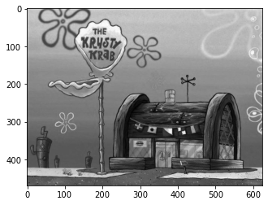
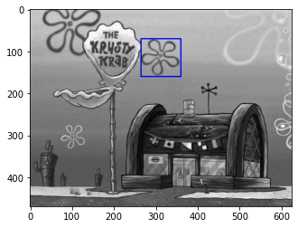

# Resolução TAREFA 1

- **Como uma imagem é representada no computador? Matriz, Vetor?**
  - Uma imagem é um conjunto de pixels que são armazenados num array em forma de matriz multidimensional.
- **O que é um pixel e o que representa os valores de 0 a 255?**
  - Como o computador entende números e não cores, cada pixel é salvo no computador como um valor que corresponde a intensidade de cor presente nele. (0 - totalmente preto, 255 - totalmente branco | para imagens coloridas utiliza-se a mesma lógica, mas para o sistema RGB)
----

###  Produza um código que carregue uma imagem do disco, desenhe um retangulo em qualquer posição e exiba na tela.

#### Código

- [Arquivo Jupyter Notebook (.ipynb)](https://github.com/mrslima/PUC_BCC/blob/main/opencv/jupyter-code.ipynb)

```python
#!/usr/bin/python
# -*- coding: utf-8 -*-

"""
DEPENDENCIES

pip install opencv-python
pip install matplotlib
"""

import cv2
import matplotlib.pyplot as plt

image = cv2.imread('img_gray.jpg')
cv2.imshow('Original Image | PRESSIONE ALGUMA TECLA PARA PROSSEGUIR', image)
cv2.waitKey(0)
image = cv2.rectangle(image, (265, 70), (360, 160), (0, 0, 255), 2)
cv2.imshow('Modified Image | PRESSIONE ALGUMA TECLA PARA FECHAR TUDO', image)
cv2.waitKey(0)
cv2.destroyAllWindows()

```

#### Resultados


